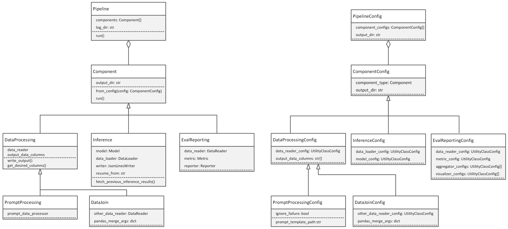

# Eureka ML Insights Framework
<p align="left">
  <a href='https://arxiv.org/abs/2409.10566'>
    
  </a>
  <a href='https://arxiv.org/pdf/2504.00294'>
    
  </a>
  <a href='https://huggingface.co/datasets/microsoft/Eureka-Bench-Logs/tree/main'>
    
    Eureka Evaluation Logs
  </a>
  <a href='https://microsoft.github.io/eureka-ml-insights'>
    
    Project Website
  </a>
</p>

This repository contains the code for the Eureka ML Insights framework. The framework is designed to help researchers and practitioners run reproducible evaluations of generative models using a variety of benchmarks and metrics efficiently. The framework allows the user to define custom pipelines for data processing, inference, and evaluation, and provides a set of pre-defined evaluation pipelines for key benchmarks.

## 📰 News

- **[2025/5/20]**: We have uploaded logs from all experiment reported in our papers on [HuggingFace](https://huggingface.co/datasets/microsoft/Eureka-Bench-Logs/tree/main). 
- **[2025/4/29]**: New blog post out [Eureka Inference-Time Scaling Insights: Where We Stand and What Lies Ahead](https://www.microsoft.com/en-us/research/articles/eureka-inference-time-scaling-insights-where-we-stand-and-what-lies-ahead/)
- **[2025/3/31]**: ✨ We have a new paper out [Inference-Time Scaling for Complex Tasks: Where We Stand and What Lies Ahead](https://arxiv.org/abs/2504.00294)
- **[2024/9/17]**: New blog post out [Eureka: Evaluating and understanding progress in AI](https://aka.ms/eureka-ml-insights-blog)
- **[2024/9/17]**: ✨ New paper out [Eureka: Evaluating and Understanding Large Foundation Models](https://arxiv.org/abs/2409.10566)
## Table of Contents
- [Eureka ML Insights Framework](#eureka-ml-insights-framework)
  - [📰 News](#-news)
  - [Table of Contents](#table-of-contents)
  - [Benchmarks](#benchmarks)
  - [Installation](#installation)
    - [📦 Installing with pip + editable for development](#-installing-with-pip--editable-for-development)
    - [📦 Generate wheel package to share with others](#-generate-wheel-package-to-share-with-others)
    - [🐍Installing with Conda](#installing-with-conda)
  - [🚀 Quick start](#-quick-start)
  - [🗺️ Overview of Experiment Pipelines](#️-overview-of-experiment-pipelines)
    - [⚒️ Utility Classes Used in Components](#️-utility-classes-used-in-components)
    - [🪛 Configuring the Data Processing Component](#-configuring-the-data-processing-component)
    - [🪛 Configuring the Prompt Processing Component](#-configuring-the-prompt-processing-component)
    - [🪛 Configuring the Inference Component](#-configuring-the-inference-component)
    - [🪛 Configuring the Evaluation Reporting Component](#-configuring-the-evaluation-reporting-component)
- [✋ How to contribute:](#-how-to-contribute)
- [✒️ Citation](#️-citation)
- [Responsible AI Considerations](#responsible-ai-considerations)

## Benchmarks
The following table summarizes the benchmarks included in Eureka-Bench, their modalities, capabilities, and the corresponding experiment pipelines. The logs for each benchmark are available for download at the links provided in the table.

| Benchmark <br> #prompts       | Modality  | Capability           |Logs| Pipeline Config |
|-------------------------------|---------------|----------------------|------|-----|
| GeoMeter <br> 1086            | Image -> Text | Geometric Reasoning  | [GeoMeter.zip](https://huggingface.co/datasets/microsoft/Eureka-Bench-Logs/resolve/main/GeoMeter.zip) | [geometer.py](eureka_ml_insights/user_configs/geometer.py) |
| MMMU <br> 900                 | Image -> Text | Multimodal QA        | [MMMU.zip](https://huggingface.co/datasets/microsoft/Eureka-Bench-Logs/resolve/main/MMMU.zip) |[mmmu.py](eureka_ml_insights/user_configs/mmmu.py)|
| Image Understanding <br> 10249| Image -> Text | Object Recognition <br> Object Detection <br> Visual Prompting <br> Spatial Reasoning | [IMAGE_UNDERSTANDING.zip](https://huggingface.co/datasets/microsoft/Eureka-Bench-Logs/resolve/main/IMAGE_UNDERSTANDING.zip) | [object_recognition.py](eureka_ml_insights/user_configs/image_understanding/object_recognition.py) <br> [object_detection.py](eureka_ml_insights/user_configs/image_understanding/object_detection.py) <br> [visual_prompting.py](eureka_ml_insights/user_configs/image_understanding/visual_prompting.py) <br> [spatial_reasoning.py](eureka_ml_insights/user_configs/image_understanding/spatial_reasoning.py) |
| Vision Language <br> 13500    | Image -> Text | Spatial Understanding <br> Navigation <br> Counting| [VISION_LANGUAGE.zip](https://huggingface.co/datasets/microsoft/Eureka-Bench-Logs/resolve/main/VISION_LANGUAGE.zip) |[spatial_map.py](eureka_ml_insights/user_configs/vision_language/spatial_map.py) <br> [maze.py](eureka_ml_insights/user_configs/vision_language/maze.py) <br> [spatial_grid.py](eureka_ml_insights/user_configs/vision_language/spatial_grid.py)|
| IFEval <br> 541                 | Text -> Text | Instruction Following        | [Evaluation logs](https://huggingface.co/datasets/microsoft/Eureka-Bench-Logs/resolve/main/IFEval.zip) <br> [Inference scaling logs](https://huggingface.co/datasets/microsoft/Eureka-Bench-Logs/tree/main/IFEval) |[ifeval.py](eureka_ml_insights/user_configs/ifeval.py)|
| FlenQA <br> 12000               | Text -> Text | Long Context Multi-hop QA | [All Logs](https://huggingface.co/datasets/microsoft/Eureka-Bench-Logs/tree/main/FlenQA) |[flenQA.py](eureka_ml_insights/user_configs/flenqa.py)|
| Kitab <br> 34217                | Text -> Text | Information Retrieval        | [Evaluation logs](https://huggingface.co/datasets/microsoft/Eureka-Bench-Logs/resolve/main/Kitab.zip) <br> [Inference scaling logs](https://huggingface.co/datasets/microsoft/Eureka-Bench-Logs/tree/main/Kitab) |[kitab.py](eureka_ml_insights/user_configs/kitab.py)|  
| Toxigen <br> 10500              | Text -> Text | Toxicity Detection <br> Safe Language Generation         | [All logs](https://huggingface.co/datasets/microsoft/Eureka-Bench-Logs/tree/main/Toxigen) |[toxigen.py](eureka_ml_insights/user_configs/toxigen.py)|
| AIME (1983-2025) <br> 979               | Text -> Text | Mathematical Reasoning| [All Logs](https://huggingface.co/datasets/microsoft/Eureka-Bench-Logs/tree/main/AIME) | [aime.py](eureka_ml_insights/user_configs/aime.py)|
| Omni-Math <br> 4,428              | Text -> Text | Mathematical Reasoning| [All Logs](https://huggingface.co/datasets/microsoft/Eureka-Bench-Logs/tree/main/Omni_Math_Parallel_PIPELINE) | [omni_math.py](eureka_ml_insights/user_configs/omni_math.py)|
| BA Calendar <br> 2000         | Text -> Text | Calendar Planning        | [All Logs](https://huggingface.co/datasets/microsoft/Eureka-Bench-Logs/tree/main/BA_Calendar) |[ba_calendar.py]([eureka_ml_insights/user_configs/ba_calendar.py](https://github.com/microsoft/eureka-ml-insights/blob/vibhav/sat3/eureka_ml_insights/user_configs/ba_calendar.py))|
| GPQA <br> 448         | Text -> Text | Graduate level science QA        | [All Logs](https://huggingface.co/datasets/microsoft/Eureka-Bench-Logs/tree/main/GPQA) |[gpqa.py](eureka_ml_insights/user_configs/gpqa.py)|
| TSP <br> 800         | Text -> Text | NP-Hard Traveling Salesman Problems        | [All Logs](https://huggingface.co/datasets/microsoft/Eureka-Bench-Logs/tree/main/TSP) |[tsp.py](eureka_ml_insights/user_configs/nphard_tsp.py)|
| SAT <br> 960         | Text -> Text | NP-Hard Satisfiability Problems        | [All Logs](https://huggingface.co/datasets/microsoft/Eureka-Bench-Logs/tree/main/SAT) |[sat.py](eureka_ml_insights/user_configs/nphard_sat.py)|

Note: The benchmarks on Image Understanding will be available soon on HuggingFace. Please stay tuned.

For non-determinism evaluations using the above benchmarks, we provide pipelines in [nondeterminism.py](eureka_ml_insights/user_configs/nondeterminism.py) 

## Installation
To get started, clone this repository to your local machine and navigate to the project directory.

### 📦 Installing with pip + editable for development
1. ```python3 -m venv .venv```
2. Activate venv.
3. ```pip install -e .```

### 📦 Generate wheel package to share with others
1. *activate venv*
2. Update version inside setup.py if needed.
3. Install wheel package via ```pip install wheel```
4. ```python setup.py bdist_wheel```
5. Fetch from dir dist/ the .whl
6. This file can be installed via `pip install eureka_ml_insights.whl`

### 🐍Installing with Conda
1. Make sure you have [Conda](https://docs.anaconda.com/free/miniconda/) installed on your system.
2. Open a terminal and create a new Conda environment using the `environment.yml` file:\
    ```conda env create --name myenv --file environment.yml```
3. Activate your newly created environment:\
    `conda activate myenv`
4. [Optional] Install GPU packages if you have a GPU machine and want to self-host models:\
    ```conda env update --file environment_gpu.yml```
Installation tested for Unix/Linux, but it is currently not supported on Windows.

## 🚀 Quick start
To reproduce the results of a pre-defined experiment pipeline, you can run the following command:

```python main.py --exp_config exp_config_name --model_config model_config_name --exp_logdir your_log_dir```

For example, to run the `FlenQA_Experiment_Pipeline` experiment pipeline defined in `eureka_ml_insights/user_configs/flenqa.py` using the OpenAI O1 Preview model, you can run the following command:

```python main.py --exp_config FlenQA_Experiment_Pipeline --model_config OAI_O1_PREVIEW_CONFIG --exp_logdir openai_o1_preview```

The results of the experiment will be saved in a directory under `logs/FlenQA_Experiment_Pipeline/openai_o1_preview`. For each experiment you run with these configurations, a new directory will be created using the date and time of the experiment run. 
For other available experiment pipelines and model configurations, see the `eureka_ml_insights/user_configs` and `eureka_ml_insights/configs` directories, respectively. In [model_configs.py](eureka_ml_insights/configs/model_configs.py) you can configure the model classes to use your API keys, Key Vault urls, endpoints, and other model-specific configurations.

## 🗺️ Overview of Experiment Pipelines

Experiment pipelines define the sequence of components that are run to process data, run inference, and evaluate the model outputs. You can find examples of experiment pipeline configurations in the `user_configs` directory. To create a new experiment configuration, you need to define a class that inherits from `ExperimentConfig` and implements the `configure_pipeline` method. In the `configure_pipeline` method you define the Pipeline config (arrangement of Components) for your Experiment. Once your class is ready, add it to `user_configs/__init__.py` import list.


Your Pipeline can use any of the available Components which can be found under the `core` directory:
- `PromptProcessing`: you can use this component to prepare your data for inference, apply transformation, or apply a Jinja prompt template.
- `DataProcessing`: you can use this component to to post-process the model outputs.
- `Inference`: you can use this component to run your model on any processed data, for example running inference on the model subject to evaluation, or another model that is involved in the evaluation pipeline as an evaluator or judge.
- `EvalReporting`: you can use this component to evaluate the model outputs using various metrics, aggregators and visualizers, and generate a report.
- `DataJoin`: you can use this component to join two sources of data, for example to join the model outputs with the ground truth data for evaluation.

Note that:
- You can inherit from one of the existing experiment config classes and override the necessary attributes to reduce the amount of code you need to write. You can find examples of this in [spatial_reasoning.py](eureka_ml_insights/user_configs/image_understanding/spatial_reasoning.py).
- Your pipeline does not need to use all of the components. You can use only the components you need. And you can use the components multiple times in the pipeline.
- Make sure the input of each component matches the output of the previous component in the pipeline. The components are run sequentially in the order they are defined in the pipeline configuration.
- For standard scenarios you do not need to implement new components for your pipeline, but you do need to configure the existing components to use the correct utility classes (i.e. models, data readers, metrics, etc.) for your scenario.

### ⚒️ Utility Classes Used in Components
Utility classes include Models, Metrics, DataLoaders, DataReaders, etc. The components in your pipeline need to use the correct utility classes for your scenario. For example, to evaluate an OpenAI model on a dataset that is available on HuggingFace, you need to use the [`HFDataReader`](eureka_ml_insights/data_utils/data.py) data reader and the [`AzureOpenAIModel`](eureka_ml_insights/models/models.py) (or alternatively, `DirectOpenAIModel`) model class. In standard scenarios do not need to implement new components for your pipeline, but you do need to configure the existing components to work with the correct utility classes. If you need a functionality that is not provided by the existing utility classes, you can implement a new utility class and use it in your pipeline.

In general, to find out what utility classes and other attributes need to be configured for a component, you can look at the component's corresponding Config dataclass in `configs/config.py`. For example, if you are configuring the `DataProcessing` component, you can look at the `DataProcessingConfig` dataclass in `configs/config.py`.

Utility classes are also configurable. You can do so by providing the name of the class and the initialization arguments. For example see ModelConfig in `configs/config.py` that can be initialized with the model class name and the model initialization arguments. For example, you can see examples of configuring Model classes in `configs/model_configs.py`. 

Our current components use the following utility classes: `DataReader`, `DataLoader`, `Model`, `Metric`, `Aggregator`. You can use the existing utility classes or implement new ones as needed to configure your components.

### 🪛 Configuring the Data Processing Component
This component is used for general data processing tasks.

- `data_reader_config`: Configuration for the DataReader that is used to load the data into a pandas dataframe, apply any necessary processing on it (optional), and return the processed data. We currently support local and Azure Blob Storage data sources.
    - Transformations: you can find the available transformations in `data_utils/transforms.py`. If you need to implement new transform classes, add them to this file.
- `output_dir`: This is the folder name where the processed data will be saved. This folder will automatically be created under the experiment log directory and the processed data will be saved in a file called `processed_data.jsonl`.
- `output_data_columns` (OPTIONAL): This is the list of columns to save in transformed_data.jsonl. By default, all columns are saved.

### 🪛 Configuring the Prompt Processing Component
This component inherits from the DataProcessing component and is used specifically for prompt processing tasks, such as applying a Jinja prompt template. If a prompt template is provided, the processed data will have a 'prompt' column that is expected by the inference component. Otherwise the input data is expected to already have a 'prompt' column. This component also reserves the "model_output" column for the model outputs so if it already exists in the input data, it will be removed. 

In addition to the attributes of the DataProcessing component, the PromptProcessing component has the following attributes:
- `prompt_template_path` (OPTIONAL): This template is used to format your data for model inference in case you need prompt templating or system prompts. Provide your jinja prompt template path to this component. See for example `prompt_templates/basic.jinja`. The prompt template processing step adds a 'prompt' column to the processed data, which is expected by the inference component. If you do not need prompt templating, make sure your data already does have a 'prompt' column.
- `ignore_failure` (OPTIONAL): Whether to ignore the failure of prompt processing on a row and move on to the next, or to raise an exception. Default is False.

### 🪛 Configuring the Inference Component
- `model_config`: Configuration of the model class to use for inference. You can find the available models in `models/`.
- `data_loader_config`: Configuration of the data_loader class to use for inference. You can find the available data classes in `data_utils/data.py`.
- `output_dir`: This is the folder name where the model outputs will be saved. This folder will automatically be created under the experiment log directory and the model outputs will be saved in a file called `inference_result.jsonl`.

### 🪛 Configuring the Evaluation Reporting Component
- `data_reader_config`: Configuration object for the DataReader that is used to load the data into a pandas dataframe. This is the same type of utility class used in the DataProcessing component.
- `metric_config`: a MetricConfig object to specify the metric class to use for evaluation. You can find the available metrics in `metrics/`. If you need to implement new metric classes, add them to this directory.
- `aggregator_configs`/`visualizer_configs`: List of configs for aggregators/visualizers to apply to the metric results. These classes that take metric results and aggragate/analyze/vizualize them and save them. You can find the available aggregators and visualizers in `metrics/reports.py`.
- `output_dir`: This is the folder name where the evaluation results will be saved.

# ✋ How to contribute:
This project welcomes contributions and suggestions. Most contributions require you to agree to a Contributor License Agreement (CLA) declaring that you have the right to, and actually do, grant us the rights to use your contribution. For details, visit https://cla.microsoft.com.

When you submit a pull request, a CLA-bot will automatically determine whether you need to provide a CLA and decorate the PR appropriately (e.g., label, comment). Simply follow the instructions provided by the bot. You will only need to do this once across all repositories using our CLA.

This project has adopted the [Microsoft Open Source Code of Conduct](https://opensource.microsoft.com/codeofconduct/).
For more information see the [Code of Conduct FAQ](https://opensource.microsoft.com/codeofconduct/faq/) or contact [opencode@microsoft.com](mailto:opencode@microsoft.com) with any additional questions or comments.

To contribute to the framework:
- please create a new branch.
- Implement your pipeline configuration class under `user_configs`, as well as any utility classes that your pipeline requires.
- Please add end-to-end tests for your contributions in the `tests` directory.
- Please add unit tests for any new utility classes you implement in the `tests` directory.
- Please add documentation to your classes and methods in form of docstrings.
- Then use `make format-inplace` to format the files you have changed. This will only work on files that git is tracking, so make sure to `git add` any newly created files before running this command.
- Use `make linters` to check any remaining style or format issues and fix them manually.
- Use `make test` to run the tests and make sure they all pass.
- Finally, submit a pull request.

# ✒️ Citation
If you use this framework in your research, please cite the following papers:

```
@article{eureka2024,
  title={Eureka: Evaluating and Understanding Large Foundation Models},
  author={Balachandran, Vidhisha and Chen, Jingya and Joshi, Neel and Nushi, Besmira and Palangi, Hamid and Salinas, Eduardo and Vineet, Vibhav and Woffinden-Luey, James and Yousefi, Safoora},
  journal={Microsoft Research. MSR-TR-2024-33},
  year={2024}
}
```
```
@article{eureka2025,
  title={Time Scaling for Complex Tasks: Where We Stand and What Lies Ahead},
  author={Balachandran, Vidhisha and Chen, Jingya and Chen, Lingjiao and Garg, Shivam and Joshi, Neel and Lara, Yash and Langford, John and Nushi, Besmira and Vineet, Vibhav and Wu, Yue and Yousefi, Safoora},
  journal={Microsoft Research. MSR-TR-2025-16},
  year={2025}
}
```
# Responsible AI Considerations
 
A cross-cutting dimension for all capability evaluations is the evaluation of several aspects of model behavior important for the responsible fielding of AI systems. These consideration include the fairness, reliability, safety, privacy, and security of models. While evaluations through the Toxigen dataset (included in Eureka-Bench) capture notions of representational fairness for different demographic groups and, to some extent, the ability of the model to generate safe language despite non-safe input triggers in the prompt, other aspects or nuances of fairness and safety require further evaluation and additional clarity, which we hope to integrate in future versions and welcome contributions for. We are also interested in expanding Eureka-Bench with tasks where fairness and bias can be studied in more benign settings that simulate how risks may appear when humans use AI to assist them in everyday tasks (e.g. creative writing, information search etc.) and subtle language or visual biases encoded in training data might be reflected in the AI's assistance.
 
A general rising concern on responsible AI evaluations is that there is a quick turnaround between new benchmarks being released and then included in content safety filters or in post training datasets. Because of this, scores on benchmarks focused on responsible and safe deployment may appear to be unusually high for most capable models. While the quick reaction is a positive development, from an evaluation and understanding perspective, the high scores indicate that the benchmarks are not sensitive enough to capture differences in alignment and safety processes followed for different models. At the same time, it is also the case that fielding thresholds for responsible AI measurements can be inherently higher and as such these evaluations will require a different interpretation lens. For example, a 5 percent error rate in instruction following for content length should not be weighed in the same way as a 5 percent error rate in detecting toxic content, or even a 5 percent success rates in jailbreak attacks. Therefore, successful and timely evaluations to this end depend on collaborative efforts that integrate red teaming, quantified evaluations, and human studies in the context of real-world applications.
 
Finally, Eureka and the set of associated benchmarks are only the initial snapshot of an effort that aims at reliably measuring progress in AI. Our team is excited about further collaborations with the open-source community and research, with the goal of sharing and extending current measurements for new capabilities and models. Our current roadmap involves enriching Eureka with more measurements around planning, reasoning, fairness, reliability and safety, and advanced multimodal capabilities for video and audio.